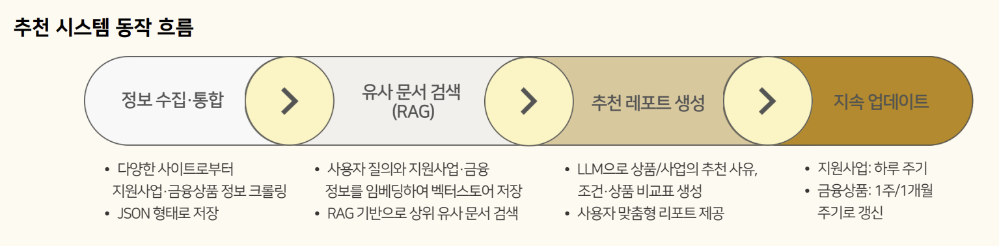
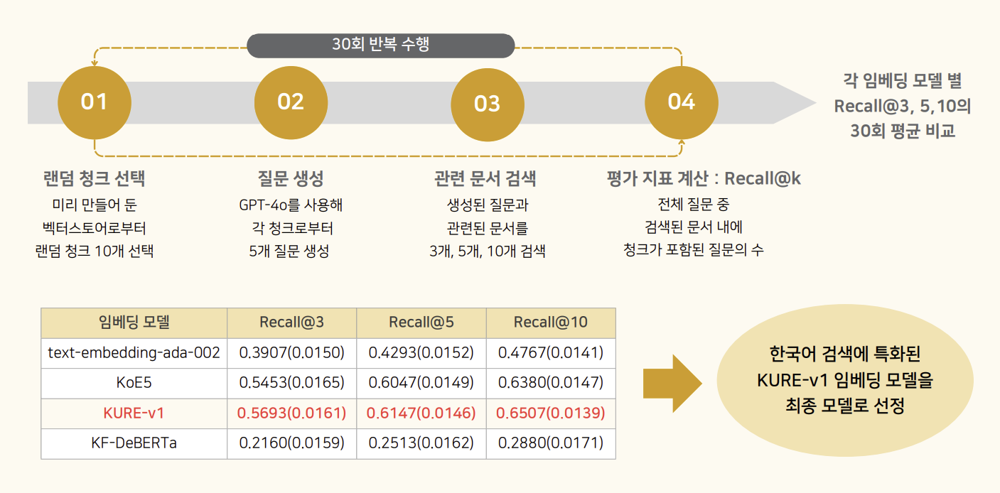
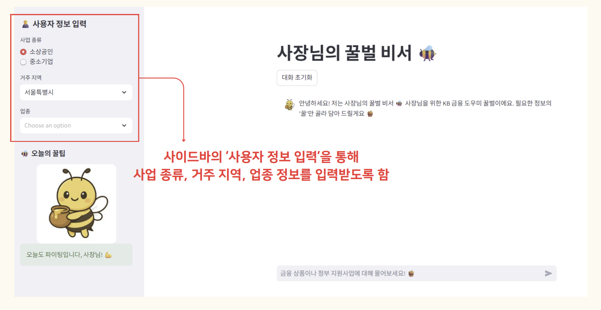
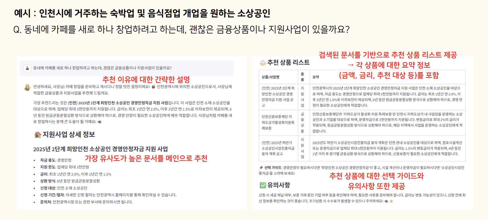
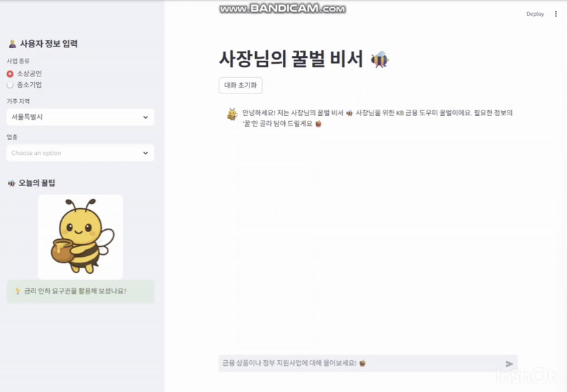

# 🪙 KB AI Challenge - 사장님의 꿀벌비서 : 사장님을 위한 KB 금융 도우미

📌 **공모전/해커톤 개요**  
본 프로젝트는 **2025 KB AI Challenge**에서 진행된 데이터 분석 공모전으로,  
**소상공인 및 중소기업을 위한 맞춤형 금융상품과 지원사업을 추천해주는 RAG 기반 챗봇을 구축**하고자 하였습니다.

📌 **발표 자료 및 코드**  
🔗 [발표 자료](https://github.com/HyeyoonKim0711/2025-KB-AI-Challenge/blob/main/fig/KB%20AI%20Challenge.pdf)  
🔗 [코드 저장소](https://github.com/HyeyoonKim0711/2025-KB-AI-Challenge/tree/main/utils)

---

## 🎯 공모전/해커톤 정보

- **대회명**: 2025 KB AI Challenge
- **주최 기관**: KB 국민은행
- **참가 팀명**: D&K
  
---

## 👥 참여 인원

2명

---

## ✅ 역할

- 기업마당 데이터 크롤링 및 전처리 
- 임베딩 모델 최적화
- 프롬프트 최적화

---

## 📊 프로젝트 개요

- **과제**: 🏠 소상공인 및 중소기업 지원 정책 및 금융상품 추천 AI 에이전트 구축
  - 중소벤처기업부, 신용보증기금, 각종 시중 은행 및 공공기관에서 공개하는 소상공인 및 중소기업 지원 정책과 금융정보를 수집
  - 사업 유형, 매출 규모, 필요 자금 등의 기본 정보를 입력하면, 조건에 맞는 정부 및 지자체 지원 정책과 최적의 금융상품 추천
  - 소상공인 및 중소기업의 금융 접근성을 높이고, 최적의 혜택을 받을 수 있도록 지원  

- **문제상황 및 프로젝트 개요**:
  - 금융상품과 정부지원사업 정보는 여러 부처와 기관에 분산되어 있어 탐색·비교가 어렵고, 정보 누락으로 인해 기회를 놓치는 경우가 많음.  
  - 소상공인과 중소기업은 **맞춤형 추천 서비스**와 **쉽게 이해할 수 있는 안내**를 필요로 함.  
  - 이를 해결하기 위해 **RAG 기반 LLM 챗봇**을 구축하여, 사용자의 조건(업종·지역·상황)에 맞는 **최적의 금융상품 및 지원사업 리포트**를 자동 제공.
   
    🖼️ **전체 동작 흐름**
    

> ### 🐝 왜 '꿀벌 비서'인가?
> - 일꾼·부지런함·열정의 상징  
> - 꿀 같은 핵심 정보를 제공해주는 이미지  
> - KB 메인 컬러 노랑과 시각적 일치 
> 
>   
> 
>   * GPT를 활용하여 생성한 이미지

- **사용 데이터셋**:
  - 기업마당 금융 지원사업 공고 데이터
  
  ➡️ 링크 내의 HWP, PNG, JPG, PDF 등 공고 파일 다운로드
  - 금융감독원의 '금융상품 한눈에'의 '개인사업자대출' 정보
  - 서민금융진흥원에서 제공하는 상품 정보 
  

---

## 💻 모델 및 기술 스택

- **LLM**:
  - **GPT-4o-mini** ➡️ GPT-3.5-turbo, 4o와 비용 및 답변의 안정성 등을 비교 후 선정

- **임베딩 최적화**:
  - `text-embedding-ada-002` (baseline)  
  - `KoE5`, `KURE-v1` (한국어 특화)  
  - `KF-DeBERTa` (금융 도메인 특화)  
  👉 최종 선정: **KURE-v1** (Recall@k 성능 기준) 

- **RAG 프레임워크**:
  - Langchain

- **VectorStore**
  - FAISS
- **챗봇 UI**
  - Streamlit

- **파이썬 라이브러리**:
`pandas`, `requests`, `selenium`, `beautifulsoup`, `pytesseract`, `OpenCV`, `olefile`, `langchain`, `FAISS`, `schedule`  

---

## 🛠 분석 과정

### 1️⃣ 데이터 수집 및 전처리

- **지원사업 데이터**: 기업마당(https://www.bizinfo.go.kr)  
- **금융상품 데이터**:  
  - 금융감독원 ‘금융상품 한눈에’ (https://finlife.fss.or.kr)  
  - 서민금융진흥원 ‘서민금융 한눈에’ (https://www.kinfa.or.kr)  
- **전처리 및 저장**:  
  - PDF, HWP, PNG, JPG 등 다양한 형식 → 텍스트 변환 (OCR, olefile, PDFPlumberLoader)  
  - JSON 변환 후 문장화 → TXT 저장  
  - 불필요한 개행/기호 제거 + 메타데이터 부착 후 청크 단위 임베딩  

- **📍 자동 크롤링 스케줄러**:  
  - 기업마당: 매일 00:00  
  - 금융감독원: 매주 월요일 08:00  
  - 서민금융진흥원: 매월 1일 00:00  
  - → `schedule` 라이브러리 기반 자동화 + 로그 기록  

---

### 2️⃣ 임베딩 모델 최적화 및 벡터스토어 구축

- 검색 성능 향상을 위해 다양한 임베딩 모델 비교
  - 일반적으로 RAG에 사용되는 OpenAI의 Default 임베딩 모델은 한국어에 특화되어있지 않음
  - RAG에 사용될 데이터가 금융 도메인의 한국어 데이터임을 고려하여 **다양한 임베딩 모델의 검색 성능 비교하여 최적화**
- 🔍 최종적으로 **Recall@3, 5, 10에서 모두 뛰어난 성능을 보인 KURE-v1 임베딩 모델을 최종 모델로 선정**

  

- 📝 **Langchain 라이브러리 내의 FAISS 벡터스토어를 사용**
  - 문서 청크화 ➡️ 임베딩 변환 ➡️ 벡터 인덱스 생성

---

### 3️⃣ 챗봇 구현

- **UI**: Streamlit  
  - 사이드바에 사용자 입력: 업종, 지역, 사업종류 
  
    

  - 질의 입력 후 챗봇이 추천 상품 및 지원사업 제시  

- **응답 구조**:  
  - 가장 유사도가 높은 문서를 기반으로 추천  
  - 추천 이유 및 요약 정보 제공 (금액, 금리, 추천 대상 등)  
  - 선택 가이드 및 유의사항 포함  

📸 **구현 결과 예시**:  

- 질의: ***“동네에 카페를 새로 하나 창업하려고 하는데, 괜찮은 금융상품이나 지원사업이 있을까요?”*** 
- 응답: **관련 상품 리스트 + 요약 정보 + 추천 상품 리스트 +추천 사유** 

  

🎥 [사용 예시 동영상](https://github.com/HyeyoonKim0711/2025-KB-AI-Challenge/blob/main/fig/%EC%B1%97%EB%B4%87%20%EA%B5%AC%ED%98%84%20%EC%98%81%EC%83%81.mp4)  

---

## 📈 기대 효과  

- 분산된 금융·지원사업 정보를 한 곳에서 탐색 가능  
- 정책 변경/신규 상품을 신속히 반영하여 정보 누락 최소화  
- 소상공인·중소기업 맞춤형 의사결정 지원  
- 자동 크롤링 및 업데이트로 운영 효율성 제고  
- 금융 접근성 확대 → 경영 안정 및 성장 지원  

---

## 🚀 발전 방향  

- 마이데이터 결합 → 개인 금융 현황 맞춤형 추천  
- 금융권 특화 말뭉치 기반 → 금융 도메인 이해도 강화  
- 챗봇 이용자 피드백 반영 → 프롬프트 및 모델 개선  
- 신규 공고·조건 변경 시 알림 서비스 제공 (문자·카톡)  
- 지원사업·금융상품 신청 페이지와 직접 연동  

---

## ✨ 분석 의의  

- **분산된 정책·금융 정보를 통합**: 여러 기관·부처에 흩어져 있는 금융상품 및 지원사업 정보를 자동으로 수집·정리하여 한 곳에서 확인 가능하게 함.  
- **최신성과 신뢰성 강화**: 주기적 크롤링과 자동 업데이트를 통해 정책 변경 및 신규 금융상품을 신속히 반영, 정보 누락을 최소화.  
- **맞춤형 추천 시스템 구현**: 단순 검색이 아닌, 사용자의 업종·지역·상황에 맞춘 **개인화된 추천 리포트** 제공.  
- **정량+정성 융합 접근**: 벡터스토어 기반 RAG 모델을 통한 정량적 정보 검색과, LLM을 활용한 직관적 요약/가이드 결합.  
- **실무적 확장성**: 지자체, 금융기관, 공공기관에서 실제로 활용 가능한 **정책 의사결정 지원 도구** 및 **맞춤형 금융 서비스** 모델로 확장 가능.  

